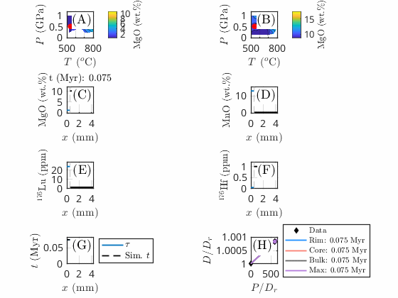

<div align="center">

<picture>
  <source media="(prefers-color-scheme: dark)" srcset="docs/assets/logo/midas_logo_horizontal_dark.svg">
  
</picture>

[](https://github.com/AnStroh/MIDAS/actions/workflows/ci-matlab.yml)
[](https://github.com/AnStroh/MIDAS/actions/workflows/ci-gui.yml)
[](https://github.com/AnStroh/MIDAS/actions/workflows/ci-octave.yml)
[](https://AnStroh.github.io/MIDAS/)
[](https://github.com/AnStroh/MIDAS/actions/workflows/spellcheck.yml)
[](LICENSE)

</div>

MIDAS is an interface-limited crystal-growth model (a moving-boundary
problem) for a garnet crystal (phase A) growing/resorbing in a matrix
(phase B), coupled to major-element (Mg-Fe-Mn) and trace-element (Lu, Hf,
Mn) diffusion and partitioning - built for modeling Lu-Hf garnet
geochronology.

> [!NOTE]
> This repository is currently **private**. The Documentation badge above
> reflects the build status of the `docs/` site, not a live page - GitHub
> Pages needs a paid plan to serve a private repo. Once the repository is
> made public, **[the full documentation](https://AnStroh.github.io/MIDAS/)** goes live at that same link.

This folder is organized into three independent copies of the same model,
so you only need the one that matches how you want to run it:

| Folder | For |
|---|---|
| [`matlab/`](matlab/) | Running from the MATLAB command line/scripts |
| [`GUI/`](GUI/) | The interactive MATLAB App Designer front-end (`MIDAS.m`) |
| [`octave/`](octave/) | Running under GNU Octave (no MATLAB license needed) - see its own [README](octave/README.md) for setup |

Each is fully self-contained (no cross-folder dependencies) and carries its
own copy of the core solver (`MIDAS_Main.m`), default parameters
(`MIDAS_Params.m`), the six example configurations, and every plotting/export
helper.

## Examples

<p align="center">
  
  
</p>

*Left: [Example1_Baseline](docs/examples.md) (phase-diagram-driven, spherical
growth). Right: [Example6_CylindricalGeometry](docs/examples.md) (cylindrical
growth geometry). Both animate the crystal/matrix interface position and
composition profile evolving along the P-T-t path; frame resolution and
grid are trimmed down here purely to keep the GIFs small - see
[`docs/examples.md`](docs/examples.md) for the full, undownsampled parameter
sets.*

## Getting started

Requires MATLAB R2019b+ (`matlab/`, `GUI/`) or GNU Octave 8.x (`octave/`
- see its [README](octave/README.md) for setup). Pick a folder above, then
in MATLAB (or Octave, for `octave/`):
```
cd matlab   % or GUI, or octave
Run_MIDAS
```
(`GUI/` instead: run `MIDAS` to launch the interactive app.)

See [`docs/getting-started.md`](docs/getting-started.md) for more.

## Graphical user interface (GUI)

For an interactive alternative to editing parameter files by hand, [`GUI/`](GUI/)
has a MATLAB App Designer front-end (`MIDAS.m`): every field of
`MIDAS_Params.m` is exposed as its own control (grouped into tabs matching
its sections), with the same explanatory text as the source file's inline
comments available as a hover tooltip. Load any of the six examples below (or the plain default) from a dropdown
to use as a starting point - every field stays freely editable afterwards -
then Run, reset to defaults, save/load a parameter preset, browse previous
runs, and export figures/data, all without leaving the app. Includes a
dark/light toggle. MATLAB only (no App Designer equivalent in Octave);
see [`docs/gui.md`](docs/gui.md) for the full guide.

## The six examples

`Run_MIDAS.m` defaults to `MIDAS_Params()`. Swap that line for any
of the six standalone example parameter files to see a different capability
of the model - each is a complete, self-contained parameter set, with every
field it does NOT use set to `NaN`:

1. **Example1_Baseline** - fully automated, phase-diagram-driven (recommended starting point)
2. **Example2_PolyEquilibrium** - no phase-diagram file needed at all
3. **Example3_ThermalBump** - the older, simpler P-T path parameterization
4. **Example4_ManualPartitioning** - phase-diagram majors + user-specified Mn partitioning
5. **Example5_PlanarGeometry** - planar growth geometry
6. **Example6_CylindricalGeometry** - cylindrical growth geometry

Together they exercise every mode switch in the model (P-T path style,
equilibrium source, Mn-partitioning source, geometry, isochron reference
point, and recording cadence). Details for each: [`docs/examples.md`](docs/examples.md).

## Documentation

That covers the basics - for the physics/numerics behind MIDAS, every
parameter and plotting function, and more, see the
**[full documentation](https://AnStroh.github.io/MIDAS/)** (see the
private-repo note above) or browse [`docs/`](docs/) directly, starting from
[`docs/index.md`](docs/index.md).

## Testing

No formal unit test suite yet. Both CI workflows (badges above) run all six
example configurations plus the full plotting/export pipeline on every
push, as a smoke check - see [`.github/scripts/smoke_test.m`](.github/scripts/smoke_test.m).
See [`CHANGELOG.md`](CHANGELOG.md) for known limitations found so far.

## Contributing

Bug reports, feature requests, and pull requests are welcome - see
[`CONTRIBUTING.md`](CONTRIBUTING.md).

## Citing

If you use MIDAS in your research, please cite it - see [`CITATION.cff`](CITATION.cff).

## References

MIDAS's moving-boundary numerics build on the same methodological family as
our sister package for diffusion-limited mineral growth,
[MovingBoundaryMinerals.jl](https://github.com/AnStroh/MovingBoundaryMinerals.jl):

- Stroh, A., Aellig, P. S., and Moulas, E.: Numerical modelling of
  diffusion-limited mineral growth for geospeedometry applications,
  *Geosci. Model Dev.*, 18, 10203-10220,
  [https://doi.org/10.5194/gmd-18-10203-2025](https://doi.org/10.5194/gmd-18-10203-2025), 2025.
- Stroh, A. and Moulas, E.: MIDAS - Mineral Interface Dynamics and
  apparent-Age Simulation (application to garnet/biotite Lu-Hf
  geochronology), *in preparation*.

See [`docs/references.md`](docs/references.md) for the full reference list
used across this documentation.

## Funding
The development of this package is supported by the DFG project 524829125 (VECTOR).

## AI use

We used Claude to help find and fix bugs, restructure the code into the
`matlab/`/`GUI/`/`octave/` layout used here, and write a clearer,
user-friendly version of it, including the GUI and logo. Claude also
helped write the documentation of the functions within the code and this
documentation site (including this README and the
[equations](docs/equations.md) page), and helped with translation and
increasing the readability of the documentation throughout. All results
were checked and are approved by the authors.

## License

MIT - see [`LICENSE`](LICENSE).

## Authors

Annalena Stroh, Evangelos Moulas - Johannes Gutenberg University Mainz (JGU), 2026
