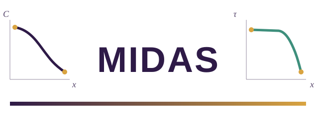
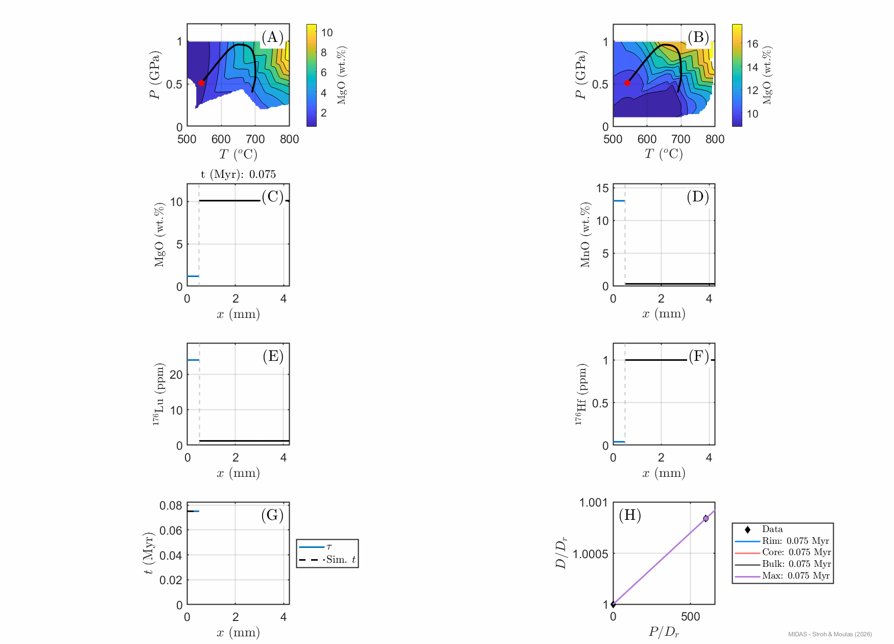

<div align="center">

<picture>
  <source media="(prefers-color-scheme: dark)" srcset="docs/assets/logo/midas_logo_horizontal_dark.svg">
  
</picture>

[](https://github.com/AnStroh/MIDAS/actions/workflows/ci-matlab.yml)
[](https://github.com/AnStroh/MIDAS/actions/workflows/ci-gui.yml)
[](https://github.com/AnStroh/MIDAS/actions/workflows/ci-octave.yml)
[](https://AnStroh.github.io/MIDAS/)
[](https://github.com/AnStroh/MIDAS/actions/workflows/spellcheck.yml)
[](LICENSE)

</div>

**MIDAS** (**M**ineral **I**nterface **D**ynamics and apparent-**A**ge **S**imulation) is a crystal-growth model that couples interface kinetics and diffusion across an explicit moving boundary (a Stefan/moving-boundary problem), for a mineral (phase A) growing or resorbing in a matrix phase (phase B), with major- and trace-element diffusion and partitioning tracked between the two. The example used throughout this repository is a garnet-biotite pair (major elements Mg-Fe; trace elements Lu, Hf, Mn), built for modeling Lu-Hf garnet geochronology, apparent and isochron ages, and interface (growth/resorption) velocities over a metamorphic P-T-t path.

> [!NOTE]
> MIDAS is under active development (currently v1.0.0) - interfaces, defaults, and file formats may still change between versions, and known limitations exist (see [CHANGELOG.md](CHANGELOG.md)). Feedback and bug reports are welcome - see [CONTRIBUTING.md](CONTRIBUTING.md).

This folder is organized into three independent copies of the same model, so you only need the one that matches how you want to run it:

| Folder | For |
|---|---|
| [`matlab/`](matlab/) | Running from the MATLAB command line/scripts |
| [`GUI/`](GUI/) | The interactive MATLAB App Designer front-end (`MIDAS.m`) |
| [`octave/`](octave/) | Running under GNU Octave (no MATLAB license needed) - see its own [README](octave/README.md) for setup |

Each is fully self-contained (no cross-folder dependencies) and carries its own copy of the core solver (`MIDAS_Main.m`), default parameters (`MIDAS_Params.m`), the six example configurations, and every plotting/export helper.

**Note:** MIDAS was originally written for and developed in MATLAB - `matlab/`/`GUI/` are the mature, primary implementation. `octave/` is a port, put through real Octave for the first time only recently; several Octave-only compatibility bugs have been found and fixed this way (see [CHANGELOG.md](CHANGELOG.md)), and more may still surface as it gets more real-world use. If you find something under Octave that works fine in MATLAB, it's likely a porting gap rather than a physics/numerics issue - please report it.

## Examples

<p align="center">
  
</p>

*[Example1_Baseline](docs/examples.md) (phase-diagram-driven, spherical growth): animates the crystal/matrix interface position and composition profile evolving along the P-T-t path. See [Examples](docs/examples.md) for this same animation alongside Example6_CylindricalGeometry's, and for the full, undownsampled parameter sets.*

## Getting started

Requires MATLAB R2019b+ (`matlab/`, `GUI/`) or GNU Octave 8.x (`octave/` - see its [README](octave/README.md) for setup). Pick a folder above, then in MATLAB (or Octave, for `octave/`):
```matlab
cd matlab   % or GUI, or octave
Run_MIDAS
```
(`GUI/` instead: run `MIDAS` to launch the interactive app.)

See [`docs/getting-started.md`](docs/getting-started.md) for more.

## Graphical user interface (GUI)

For an interactive alternative to editing parameter files by hand, [`GUI/`](GUI/) has a MATLAB App Designer front-end (`MIDAS.m`), and [`octave/`](octave/) has its own GNU Octave rebuild (`MIDAS_GUI.m`, plain `uicontrol` - Octave can't open App Designer's `.mlapp` format at all): every field of `MIDAS_Params.m` is exposed as its own control (grouped into tabs matching its sections), with the same explanatory text as the source file's inline comments available as a hover tooltip. Load any of the six examples below (or the plain default) from a dropdown to use as a starting point - every field stays freely editable afterwards - then Run, reset to defaults, save/load a parameter preset, browse previous runs, and export figures/data, all without leaving the app. See [`docs/gui.md`](docs/gui.md) for the full guide to both.

## The six examples

Want to see a different capability of the model instead of the default configuration? Open `Run_MIDAS.m` (in whichever of `matlab/`, `GUI/`, or `octave/` you're using) and find this line near the top:

```matlab
params = MIDAS_Params();
```

Replace it with the name of any of the six examples below, for example:

```matlab
params = Example2_PolyEquilibrium();
```

Save the file and run `Run_MIDAS` again - that's the only change needed; the `examples/` subfolder each example lives in is already set up to be found automatically. Each example is a complete, self-contained parameter set, with every field it does NOT use set to `NaN` so it's obvious at a glance what actually matters for that run:

1. **Example1_Baseline** - fully automated, phase-diagram-driven (recommended starting point)
2. **Example2_PolyEquilibrium** - no phase-diagram file needed at all
3. **Example3_ThermalBump** - the older, simpler P-T path parameterization
4. **Example4_ManualPartitioning** - phase-diagram majors + user-specified Mn partitioning
5. **Example5_PlanarGeometry** - planar growth geometry
6. **Example6_CylindricalGeometry** - cylindrical growth geometry

Together they exercise every mode switch in the model (P-T path style, equilibrium source, Mn-partitioning source, geometry, isochron reference point, and recording cadence). Details for each: [`docs/examples.md`](docs/examples.md).

Using the GUI instead? No file editing needed - pick one from the **Load Example** dropdown and click Load (see [Graphical user interface](#graphical-user-interface-gui) above).

## Documentation

That covers the basics - for the physics/numerics behind MIDAS, every parameter and plotting function, and more, see the **[full documentation](https://AnStroh.github.io/MIDAS/)** or browse [`docs/`](docs/) directly, starting from [`docs/index.md`](docs/index.md).

## Testing

No formal unit test suite yet. CI (badges above) runs all six example configurations plus the full plotting/export pipeline on every push, as a smoke check - see [`.github/scripts/smoke_test.m`](.github/scripts/smoke_test.m). Separately, [`tests/`](tests/) checks that `matlab/`, `GUI/`, and `octave/` agree numerically on those same six examples (not just that each runs without crashing) - see [`tests/README.md`](tests/README.md). See [`CHANGELOG.md`](CHANGELOG.md) for known limitations found so far.

## Contributing

Bug reports, feature requests, and pull requests are welcome - see [`CONTRIBUTING.md`](CONTRIBUTING.md).

## Citing

If you use MIDAS in your research, please cite it - see [`CITATION.cff`](CITATION.cff).

## References

MIDAS's moving-boundary numerics build on the same methodological family as our sister package for diffusion-limited mineral growth, [MovingBoundaryMinerals.jl](https://github.com/AnStroh/MovingBoundaryMinerals.jl):

- Stroh, A., Aellig, P. S., and Moulas, E.: Numerical modelling of diffusion-limited mineral growth for geospeedometry applications, *Geosci. Model Dev.*, 18, 10203-10220, [https://doi.org/10.5194/gmd-18-10203-2025](https://doi.org/10.5194/gmd-18-10203-2025), 2025.


See [`docs/references.md`](docs/references.md) for the full reference list used across this documentation.

## Funding
The development of this package is supported by the DFG project 524829125 (VECTOR).

## AI use

We used Claude to help find and fix bugs, restructure the code into the `matlab/`/`GUI/`/`octave/` layout used here, and build a clearer, user-friendly version of it, including the GUI and logo. Based on the authors' own instructions and content, Claude created the documentation - both the in-code function documentation and this documentation site. Furthermore, Claude helped with visualizations as well as translation and readability. Claude was not used to develop, derive, or validate any of the model's underlying physics or numerics - that work is the authors' own. All AI-assisted output was reviewed and is approved by the authors.

## Main authors

Annalena Stroh, Evangelos Moulas - Johannes Gutenberg University Mainz (JGU), 2026

## License

MIT - see [`LICENSE`](LICENSE).
